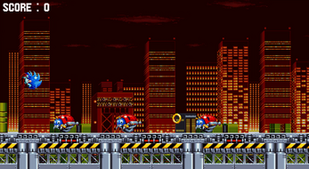
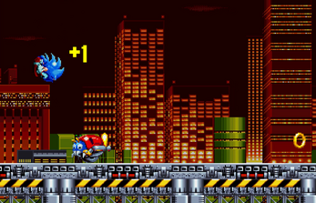
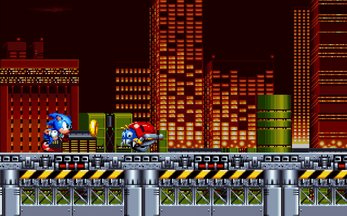

# 🏃 Sonic Ring Run

A fan-made **Sonic endless runner** game built with **JavaScript** and **Kaplay**. Collect 🏅 rings, dodge 🦾 enemies, and achieve the **highest score possible**!





---

## 🎮 Description

**Sonic Ring Run** is a **fast-paced endless runner** featuring **Sonic the Hedgehog**! Players must help Sonic **collect rings** while avoiding **Motobugs** 🐞. The game features **increasing difficulty**, **score multipliers**, and a **ranking system** 🎖️.

---

## ✨ Features

✅ **Endless runner** gameplay 🏃‍♂️💨  
✅ **Classic Sonic Mania-style** graphics 🎨 
✅ **Score & ranking system** (F to S rank) 🏆 
✅ **Progressive difficulty** increase 🔥  
✅ **Ring collection & enemy interaction** 🏅 vs. 🦾  
✅ **Background parallax effects** 🌆  
✅ **Original Sonic sound effects** 🔊  

---

## 🎮 Controls

🕹️ **Space** - Jump  
🖱️ **Left Mouse Click** - Jump  
📱 **Touch Screen** - Jump (mobile devices)  

---

## 🛠 Technologies Used

- ⚡ **JavaScript**
- 🎮 [**Kaplay**](https://github.com/kaplay) - Game Framework
- ⚙️ **Vite** - Build Tool

---

## 🚀 Installation

1️⃣ Clone the repository:  
```bash
git clone https://github.com/bluekitsune-sad/sonic-game-JavaScript.git
```

2️⃣ Navigate to the project directory:  
```bash
cd sonic-game-JavaScript
```

3️⃣ Install dependencies:  
```bash
npm install
```

4️⃣ Run the development server:  
```bash
npm run dev
```

5️⃣ Open your browser and navigate to **`http://localhost:5173`** (or the port shown in your terminal) 🌐

---

## 📦 Building for Production

To create a **production build**:
```bash
npm run build
```
This will generate a **production build** in the `dist` directory 📂.

---

## 🎨 Credits

👾 **Game Development**: bluekitsune-sad  
🎮 **Original Sonic character & assets**: Owned by SEGA  
🖼️ **Assets from**: Sonic Mania  
🔊 **Sound effects from**: Sonic games  

---

## ⚠️ Disclaimer

📝 This is a **fan-made game**. Sonic the Hedgehog and all related characters are **property of SEGA**. This project is **not affiliated with or endorsed by SEGA**.

---

## 📜 License

This project is for **educational purposes only**. All **Sonic-related assets are property of SEGA**.

🚀 Have fun and **keep running!** 🏃‍♂️💨

